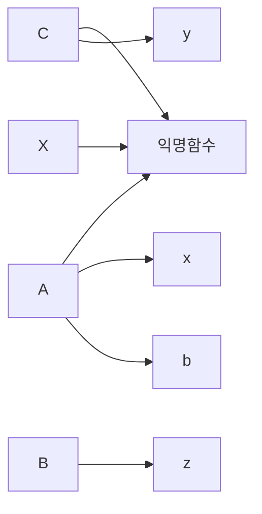

# Javascript

1. 함수선언과 호출의 차이

## 함수선언식
```js
function add(a,b) {
    return a + b
}

function calculator (func, a, b) {
    return func(a, b)
}

calculator(add, 1, 2) // 3
```

## 함수 표현식(arrow)
```js
const add = (a, b) => a + b
const calculator = (func, a, b) => func(a, b)

calculator (add, 1, 2)
```

- 가장 많이 헷갈리는 점 : 선언과 호출

```js
const add(a, b) => a + b
document.querySelector("#header").addEventListener("click", add())
// "header"를 누르면 이벤트가 안먹어요; () 호출이기 때문
```

## 응용문제

### 함수 선언식
```js
function clickHandler(e) {
    console.log("hello world")
}

function clickHandler(e) {
    return function(){
        console.log("hello world")
    }
}
document.querySelector("#header").addEventListener("click", clickHandler) // 실행이 된다
document.querySelector("#header").addEventListener("click", clickHandler()) // 고차함수로 진행
```

### 함수 표현식
```js
const clickHandler = () => () => {console.log("hello world")}        
document.querySelector("#header").addEventListener("click", clickHandler()) // 실행이 된다
```

    고차함수를 아는가?
    - 함수안에서 return 해주는것이 무엇인가?
    - 이벤트 객체를 어느 위치에 적어야 하는가?

## 2. 콜스택
```js
function c (){
    console.log("c")
}

function a (){
    console.log("a")
    function b (){
        console.log("b")
        c()
    }
    b()
}

//실행순서를 맞추세요.

a()
// "a"
// "b"
// "c"
// "b"
// "c"
b()
// "b"
// "c"
```

## 3. 스코프체인
```js
const x = "x"

function c (){
    const y = "y"
    console.log("c", x)
}

function a (){
    const x = "xx"
    console.log("a", x)
    function b (){
        const z = "z"
        console.log("b", x)
        c()
    }
    b()
}

// 순서를 맞추세요
a()
// "a" "xx"
// "b" "xx"
// "c" "x"
// "b" "xx"
// "c" "x"
c()
// "c" "x"
```

### 렉시컬 스코프


## 4. This
- 함수가 실행될 때 결정된다.

### `this가 어려운 이유`
    - function
    - 실행할 때마다 this의 값이 바뀌어 버린다.

### 함수를 사용하는 방법
#### 1. 일반 함수
```js
function Foo(a, b) {
    console.log(this) // Window
    return [a, b]
}

const foo = Foo(1, 2)
console.log(foo)
// Window
// [1, 2]
```

#### 2. 생성자 함수
- new 키워드로 인해 constructor 실행
- this 바인딩이 실행, function에 this를 준다.
    - 동적바인딩
- 사용할 때 this가 바뀐다. 즉, 실행될때 this가 정해진다.
```js
function Foo(a, b){
    // this = {}
    console.log(this) // bar
    this.arr = [a, b]
    // return this
}

const foo = new Foo(1, 2) // Foo { arr: [1, 2]}
console.log(foo)
// Foo {}
// Foo { arr: [1, 2]}
```

#### 3. 객체 메서드
- bar의 method로 실행된다.
- 함수를 실행할 떄 함수라는 객체 자체를 바인딩 받은것
```js
function Foo(a, b) {
    console.log(this)
    return [a, b]
}
const bar = {
    method:Foo
}

bar.method(1, 2)
// {method: f Foo(a, b)}
```

## 5. functoin(this binding)

#### 간단한 일반함수
- 불필요한 값들이 들어가있다.
```js
function a (){

}
console.dir(a)
```

#### 애로우 함수
- 함수 자체 본연으로 사용이 가능하다.
- function이라는 키워드는 할 일이 너무 많다. < 애로우 함수 왜써요?
- constructor 함수가 없다.
    - this가 바뀔수 있는 binding 함수라는것이 존재.(prototype)
```js
const b = () => {}
console.dir(b)
```

### bind
#### - function.prototype.bind
- 제일 중요한 점은 함수를 this를 바꿀 수 있다.
- this보다 bind 개념이 상위개념이다.
- this를 배우기전에 bind를 배워야한다.
```js
function Foo(a, b) {
    console.log(this) // window
    return [a, b]
}

// 1.this에 넣을 값
// return 함수값을 리턴
// Foo.bind({name: "ingoo"})
const fooBind = Foo.bind({name: "ingoo"})

fooBind()
// {name: "ingoo"}

fooBind(1, 2)
// {name: "ingoo"}
// [1, 2]

const bar = {
    method:fooBind
}

bar.method(5, 6)
// {name: "ingoo"}
// [5, 6]
```
#### bind, call, apply
- bind : 함수를 반환
- call : 실행 시킨다.
- apply : 실행 시킨다.
    - 인자값을
```js
function Foo(a, b) {
    console.log(this) // window
    return [a, b]
}

// 1. this의 값
// 2. 매개변수에 대한 값을 순차적으로 적는다.
Foo.call({name:"ingoo"}, 1, 2)
// {name:"ingoo"}
// [1, 2]

// apply는 배열을 넣어야한다.
Foo.apply({name:"ingoo"}, [1, 2])
// {name:"ingoo"}
// [1, 2]
```

## *function의 다양한 사용성*
- function 키워드는 최대한 자제하라.
    - 안쓰기 시작하면 this가 보인다.

### 일반함수 function
- function 안에 있는 this는 무조건 window 객체, 상위 객체를 바라본다.
```js
function a(){
    consolo.log(this)
    function b(){
        consolo.log(this)
        function c(){
            consolo.log(this)
        }
        c()
    }
    b()
}

a()
```
### function을 대체하는 방법
- 일반함수 : `arrow`
- 생성자 함수 : `class`
- 객체 메서드 할당 : `메서드 축약형`

#### arrow 함수
```js
// 생성자 함수가 안됨.
// bind이 안된다.